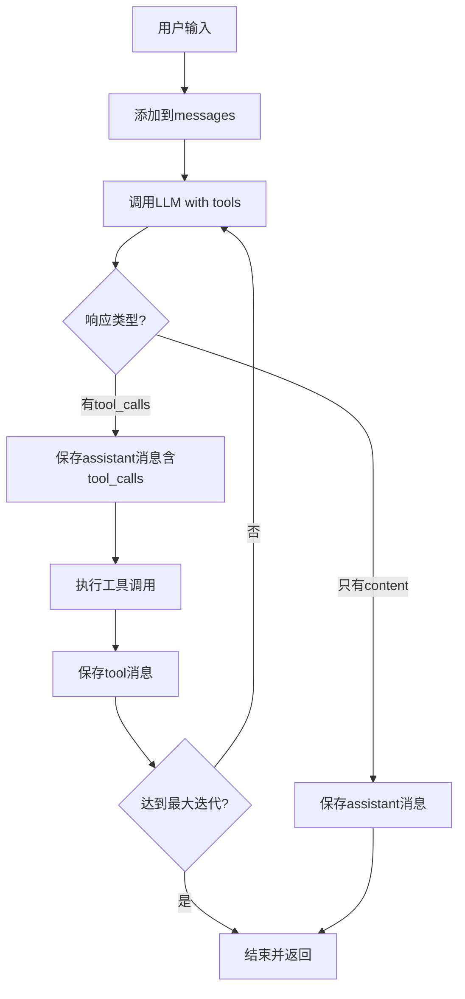

# Function Call Agent 使用指南

## 概述

Function Call Agent 是一个基于 LLM 原生 Function Calling 机制的智能体实现，它不使用 ReAct（Reasoning + Action）模式，而是完全依赖于 LLM 的内置函数调用能力。

## 核心特点

### 1. **原生 Function Calling**
- 直接使用 OpenAI API 的 `tools` 参数
- 无需特殊的提示词工程
- LLM 自主决定何时调用工具、调用哪些工具

### 2. **自动多轮迭代**
- LLM 可以多次调用工具
- 每次工具调用后，LLM 重新评估是否需要继续
- 自动终止条件：LLM 返回纯文本内容（无 tool_calls）

### 3. **流式输出支持**
- 所有 LLM 响应均支持流式传输
- 实时展示思考过程
- 工具调用结果实时反馈

### 4. **完整上下文管理**
- 严格遵循 OpenAI API 消息格式
- 保存完整的 `tool_calls` 和 `tool` 消息
- 确保对话历史可被正确解析

## 核心组件

### FunctionCallProcessor

主处理器类，负责协调 LLM 调用和工具执行。

```python
class FunctionCallProcessor:
    def __init__(
        self,
        llm_client,           # LLM 客户端
        tool_registry,        # 工具注册表
        session_manager,      # 会话管理器
        max_iterations=10     # 最大迭代次数（防止无限循环）
    ):
        ...
```

## 工作流程



## 详细步骤

### 1. 初始化阶段
```python
# 创建 Function Call 处理器
function_call_processor = FunctionCallProcessor(
    llm_client=llm_client,
    tool_registry=tool_registry,
    session_manager=session_manager,
    max_iterations=10
)
```

### 2. 处理用户消息
```python
await function_call_processor.process_streaming(
    websocket=websocket,
    session_id=session_id,
    user_input=user_input,
    messages=messages
)
```

### 3. 单次迭代流程

#### 3.1 准备请求
```python
request_params = {
    "model": self.llm_client.model,
    "messages": messages,
    "stream": True,
    "tools": self.tool_registry.get_tools_definitions()  # 关键：提供工具定义
}
```

#### 3.2 处理流式响应
```python
async for chunk in response:
    delta = chunk.choices[0].delta
    
    # 收集 tool_calls
    if delta.tool_calls:
        # 累积工具调用信息
        ...
    
    # 收集 content
    if delta.content:
        # 流式发送给前端
        await websocket.send_json({
            "type": "assistant_chunk",
            "content": delta.content
        })
```

#### 3.3 判断是否有工具调用
```python
if tool_calls:
    # 保存 assistant 消息（包含 tool_calls）
    messages.append({
        "role": "assistant",
        "content": content_buffer,
        "tool_calls": tool_calls
    })
    
    # 执行工具
    await self._execute_tool_calls(...)
    
    return True  # 需要继续迭代
else:
    # 保存 assistant 消息（最终答案）
    messages.append({
        "role": "assistant",
        "content": content_buffer
    })
    
    return False  # 结束迭代
```

### 4. 工具执行
```python
for tool_call in tool_calls:
    tool_name = tool_call["function"]["name"]
    tool_args = tool_call["function"]["arguments"]
    
    # 执行工具
    tool_result = await self.tool_registry.execute_tool(tool_name, tool_args)
    
    # 保存 tool 消息（严格遵循 OpenAI 格式）
    messages.append({
        "role": "tool",
        "tool_call_id": tool_call["id"],  # 必须匹配
        "name": tool_name,
        "content": tool_result
    })
```

## 与 LLM 交互方式

### 消息格式示例

**完整对话历史结构：**

```python
messages = [
    # 系统消息
    {
        "role": "system",
        "content": "你是一个智能助手..."
    },
    
    # 用户消息
    {
        "role": "user",
        "content": "北京今天天气怎么样？"
    },
    
    # 助手消息（包含工具调用）
    {
        "role": "assistant",
        "content": None,
        "tool_calls": [
            {
                "id": "call_abc123",
                "type": "function",
                "function": {
                    "name": "get_weather",
                    "arguments": '{"city": "北京"}'
                }
            }
        ]
    },
    
    # 工具消息
    {
        "role": "tool",
        "tool_call_id": "call_abc123",
        "name": "get_weather",
        "content": "北京今天晴天，温度25度"
    },
    
    # 助手消息（最终答案）
    {
        "role": "assistant",
        "content": "北京今天天气很好，晴天，温度25度。适合外出活动。"
    }
]
```

## 工具定义格式

工具必须遵循 OpenAI Function Calling 格式：

```python
{
    "type": "function",
    "function": {
        "name": "get_weather",
        "description": "获取指定城市的天气信息",
        "parameters": {
            "type": "object",
            "properties": {
                "city": {
                    "type": "string",
                    "description": "城市名称，例如：北京、上海"
                }
            },
            "required": ["city"]
        }
    }
}
```

## 前端调用方式

### 发送消息（指定 mode）

```javascript
// 使用 Function Call Agent
websocket.send(JSON.stringify({
    type: 'message',
    content: '北京今天天气怎么样？',
    mode: 'function_call'  // 指定使用 Function Call 模式
}));

// 对比其他模式
// mode: 'react' - 使用 ReAct Agent
// mode: 'simple' - 使用简单处理器（单次工具调用）
```

### 接收消息

```javascript
websocket.onmessage = (event) => {
    const data = JSON.parse(event.data);
    
    switch(data.type) {
        case 'assistant_start':
            // 开始接收助手响应
            break;
            
        case 'assistant_chunk':
            // 流式内容
            appendContent(data.content);
            break;
            
        case 'tool_calls_start':
            // 工具调用开始
            showToolCallsSection(data.tools);
            break;
            
        case 'tool_call':
            // 单个工具调用结果
            displayToolResult(data.toolName, data.toolResult);
            break;
            
        case 'assistant_end':
            // 响应结束
            break;
    }
};
```

## 与 ReAct Agent 的对比

| 特性 | Function Call Agent | ReAct Agent |
|------|---------------------|-------------|
| **实现方式** | LLM 原生 Function Calling | 提示词工程 + 输出解析 |
| **工具调用决策** | LLM 自主决定 | 需要解析 Thought/Action |
| **提示词复杂度** | 无需特殊提示词 | 需要详细的 ReAct 提示词 |
| **错误处理** | LLM 内置 | 需要手动解析和处理 |
| **多轮调用** | 自动支持 | 需要循环控制 |
| **可靠性** | 高（API 级别） | 中（依赖输出格式） |
| **适用模型** | 支持 Function Calling 的模型 | 所有对话模型 |
| **调试难度** | 低 | 中等 |

## 适用场景

### 推荐使用 Function Call Agent 的场景：
1. ✅ 使用支持 Function Calling 的模型（如 GPT-4、GPT-3.5-turbo、Qwen-Plus 等）
2. ✅ 需要稳定可靠的工具调用
3. ✅ 希望减少提示词工程的复杂度
4. ✅ 工具调用逻辑较复杂，需要多轮交互
5. ✅ 追求最佳的用户体验和响应质量

### 推荐使用 ReAct Agent 的场景：
1. ✅ 模型不支持 Function Calling
2. ✅ 需要显式的推理过程展示
3. ✅ 需要自定义思考链路
4. ✅ 对工具调用顺序有特殊要求

## 最佳实践

### 1. 设置合理的最大迭代次数
```python
# 防止无限循环
max_iterations=10  # 根据业务需求调整
```

### 2. 工具定义要清晰
```python
# 好的工具定义
{
    "name": "search_database",
    "description": "在数据库中搜索用户信息。当需要查询用户详细信息时使用此工具。",
    "parameters": {
        "type": "object",
        "properties": {
            "user_id": {
                "type": "string",
                "description": "用户唯一标识符，格式为 UUID"
            }
        },
        "required": ["user_id"]
    }
}
```

### 3. 处理取消信号
```python
# 在关键位置检查取消标志
if self.session_manager.get_cancel_flag(session_id):
    return
```

### 4. 错误处理
```python
try:
    tool_result = await self.tool_registry.execute_tool(tool_name, tool_args)
except Exception as e:
    tool_result = f"工具执行失败: {str(e)}"
    # 仍然将错误作为 tool 消息返回，让 LLM 处理
```

## 性能优化建议

1. **减少迭代次数**：优化工具定义，让 LLM 一次性获取所需信息
2. **并行工具调用**：如果 LLM 返回多个 tool_calls，可考虑并行执行（需要工具支持）
3. **缓存工具结果**：对于重复的工具调用，可以缓存结果
4. **选择合适的模型**：使用针对 Function Calling 优化的模型

## 调试技巧

### 1. 打印消息历史
```python
import json
print(json.dumps(messages, indent=2, ensure_ascii=False))
```

### 2. 监控迭代次数
```python
print(f"Iteration {iteration}/{self.max_iterations}")
```

### 3. 检查工具调用格式
```python
print(f"Tool calls: {json.dumps(tool_calls, indent=2)}")
```

## 常见问题

### Q1: 为什么 LLM 不调用工具？
**A:** 检查以下几点：
- 工具定义是否清晰
- 用户输入是否明确需要工具
- 模型是否支持 Function Calling

### Q2: 如何避免无限循环？
**A:** 设置 `max_iterations` 参数，并在工具中返回明确的结果。

### Q3: 工具调用失败如何处理？
**A:** 将错误信息作为 tool 消息返回，让 LLM 自行处理或提示用户。

### Q4: 如何支持并发工具调用？
**A:** 当前实现是串行执行，如需并发，可使用 `asyncio.gather()`：
```python
results = await asyncio.gather(*[
    self.tool_registry.execute_tool(tc["function"]["name"], tc["function"]["arguments"])
    for tc in tool_calls
])
```

## 总结

Function Call Agent 是一个高效、可靠的智能体实现方式，它充分利用了现代 LLM 的原生能力，避免了复杂的提示词工程和输出解析。对于支持 Function Calling 的模型，这是首选的实现方案。
